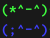
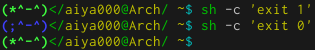
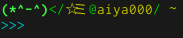
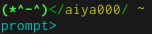

# zsh-shell-kawaii

## About
The tool of `$PROMPT` :+1:  
You can define `$PROMPT` with (or without) her **easily** !

She is ↓  


## Examples
  
  


## Install
The case of using zplug.

.zshrc
```zsh
zplug 'aiya000/zsh-shell-kawaii'
```


## Shell variables
+ `$SHELL_KAWAII_HER_VISIBILITY`
    - default value (bool): 0
    - Show pretty character if the value is 1
+ `$SHELL_KAWAII_FAKE_USERNAME`
    - default value (string): `$(whoami)`
    - Show as the user name
+ `$SHELL_KAWAII_FAKE_HOSTNAME`
    - default value (string): `$(hostname)`
    - Show to the host part if `$SHELL_KAWAII_HOST_VISIBILITY` is 1
+ `$SHELL_KAWAII_HOST_VISIBILITY`
    - default value (bool): 1
    - Don't show `$SHELL_KAWAII_FAKE_HOSTNAME` on the `$PROMPT` if the value is 0
+ `$SHELL_KAWAII_CLI_TO_LOW`
    - default value (bool): 0
    - Insert line break between the feature and CLI
+ `$SHELL_KAWAII_USER_DELIMITER`
    - default value (string): '$'
    - Show before CLI
+ `$SHELL_KAWAII_MORE_PROMPT_COMMAND`
    - default value (comnand or function): 'echo ""'
    - Insert the result to after $PROMPT or $RPROMPT
        - Please see an example
        - [.zprofile](https://github.com/aiya000/dotfiles/blob/2d14203d56a91c3ac4b12c67a06e2009f20bc740/.zsh/.zprofile#L78)
        - [.zshrc](https://github.com/aiya000/dotfiles/blob/2d14203d56a91c3ac4b12c67a06e2009f20bc740/.zsh/.zshrc#L184)


## Setting example
```zsh
# zsh-shell-kawaii
export SHELL_KAWAII_HER_VISIBILITY=1
export SHELL_KAWAII_HOST_VISIBILITY=1
export SHELL_KAWAII_FAKE_USERNAME='aiya_000'
export SHELL_KAWAII_FAKE_HOSTNAME='Arch'
```

```zsh
export SHELL_KAWAII_HER_VISIBILITY=1
export SHELL_KAWAII_HOST_VISIBILITY=1
export SHELL_KAWAII_FAKE_USERNAME='☆ミ'    # Dancing stars
export SHELL_KAWAII_FAKE_HOSTNAME='aiya000' # ミ☆   on me!
export SHELL_KAWAII_CLI_TO_LOW=1
export SHELL_KAWAII_USER_DELIMITER='>>>'
```
