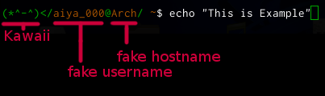
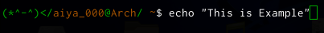

# zsh-shell-kawaii

Your shell dress up lovely (\*^-^)  
zsh-shell-kawaii show you her :)  
(\*^-^) <- her

and Show fake username and hostname on your prompt.




## Configurations
* shell variables
    + `SHELL_KAWAII_HER_VISIBILITY`
        - default value (bool): 0
    + `SHELL_KAWAII_FAKE_USERNAME`
        - default value (string): Your $USER
    + `SHELL_KAWAII_FAKE_HOSTNAME`
        - default value (string): Your $HOSTNAME
    + `SHELL_KAWAII_HOST_VISIBILIT`Y
        - default value (bool): 1

## Example
### Config
```zsh
# zsh-shell-kawaii
export SHELL_KAWAII_HER_VISIBILITY=1
export SHELL_KAWAII_HOST_VISIBILITY=1
export SHELL_KAWAII_FAKE_USERNAME='aiya_000'
export SHELL_KAWAII_FAKE_HOSTNAME='Arch'
```

### Result Prompt

